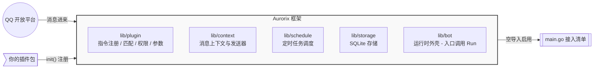

# 开发文档

Aurorix 插件开发从入门到发布。文档按主题分层，随时跳转。

## 架构总览

## 架构总览



插件是一个普通 Go 包：包内 `init()` 调用 `plugin.Register(...)` 完成注册，入口 `main.go` 空导入启用。匹配、权限、参数解析、配置热更、访问控制全部由框架承担——插件只声明指令与处理逻辑。

**生命周期**

```
包 init() → plugin.Register(...) → 框架注册指令/配置/权限
        → 启动时加载插件配置与访问控制
        → 消息命中 → 权限校验 → 参数解析 → Handle(ctx)
        → 管理台操作 → ApplyConfig 热更 / 启停 / 访问控制
```

## 开发环境

**不需要单独的 SDK。** 框架就是 SDK：实例的 `go.mod` 通过 `replace` 引用本地框架，IDE 直接解析 `lib/` 全部公开 API——自动补全、跳转定义、类型检查开箱即用。

| 工具 | 说明 |
|---|---|
| GoLand / VS Code | 安装官方 Go 插件（gopls），打开实例目录即可 |
| 语法补全 | `ctx.` 后即出全部方法（Text/Markdown/Image...），`plugin.` 出 Register |
| 类型检查 | 写错签名立即报错，无需编译 |
| 参考实现 | 框架 `plugins/` 下 4 个官方插件源码是最佳活文档 |

建议把框架目录加入 IDE 的同一工作区（GoLand 的 Multi-root / VS Code 的 multi-root workspace），跨工程跳转更顺。

## 第一个插件

在实例目录执行：

```bash
aurx new-plugin hello     # 生成 plugins/hello/hello.go
aurx add mybot/plugins/hello   # 写入 main.go 空导入
```

生成的骨架：

```go
package hello

import (
	"embed"
	"github.com/KasumiYuku/Aurorix/lib/constant"
	"github.com/KasumiYuku/Aurorix/lib/context"
	"github.com/KasumiYuku/Aurorix/lib/plugin"
)

//go:embed templates/markdown/*.md
var templateFS embed.FS

func init() {
	plugin.Register(&plugin.Plugin{
		Id:         "hello",
		Name:       "hello",
		TemplateFS: templateFS,
		Commands: []*plugin.Command{
			{
				Prefix:   "hello",
				Role:     constant.RoleMember,
				Describe: "hello",
				Handle:   cmd,
			},
		},
	})
}

func cmd(ctx *context.MessageContext) error {
	return ctx.Text("插件运行中").Send()
}
```

目录结构（`templates/markdown/Hello.md` 是模板文件，随插件 embed 进二进制）：

```
mybot/plugins/hello/
├── hello.go              插件主体
└── templates/markdown/Hello.md
```

### 给插件加一个 Markdown 模板

模板按文件名注册（`Hello.md` → 模板 ID `Hello`），编辑 `plugins/hello/templates/markdown/Hello.md`：

```markdown
### 你好 {{name}}

你发的内容: {{body}}
```

指令里用 `ctx.MarkdownTemplate` 填充并发送（先 import 模板包）：

```go
import "github.com/KasumiYuku/Aurorix/lib/templates"   // 加在 import 块里

func cmd(ctx *context.MessageContext) error {
	md, err := ctx.MarkdownTemplate("Hello", &templates.Args{
		"name": "机器人",
		"body": ctx.Parsed,
	})
	if err != nil {
		return err
	}
	return md.Send()
}
```

模板填充失败返回 error；确定模板与参数匹配、想少写错误分支时可用 `ctx.UnsafeMarkdownTemplate`（失败直接 panic）：

模板的解析规则：插件命名空间优先，未命中回落全局命名空间（框架内置模板如 `Card`）。`templates/markdown` 内可放任意多个 `.md`，文件名即模板 ID。更多规则见 [message.md](message.md#markdown-模板)。

编辑 `plugins/hello/hello.go` 写你的逻辑，然后：

```bash
aurx run    # 重新编译并启动
```

群里发送 `/hello` 验证。改代码 → `aurx run`，循环迭代。

## 文档导航

| 文档 | 主题 |
|---|---|
| [commands.md](commands.md) | 指令开发：Command 全字段、前缀与匹配、参数解析、子指令、权限角色 |
| [message.md](message.md) | 消息开发：全部构造器、组合消息、Markdown 模板、按钮键盘、图片与媒体 |
| [schedule.md](schedule.md) | 定时任务：Cron / 间隔、预设目标、任务管理 |
| [storage.md](storage.md) | 配置热更与数据存储：ConfigField、Validate/Apply、存储命名空间 |
| [events.md](events.md) | 事件与能力：群事件回调、按钮交互回执、HTTP 客户端、图床 Provider |
| [push.md](push.md) | 主动推送：HTTP 端点完整协议、鉴权、状态码、管理指令 |
| [api.md](api.md) | API 全景参考：BotAPI 门面、流式消息、HTTP 客户端、日志、常量 |
| [publishing.md](publishing.md) | 完整开发流程、发布插件、生态接入（本地文件夹 / 网络模块） |
